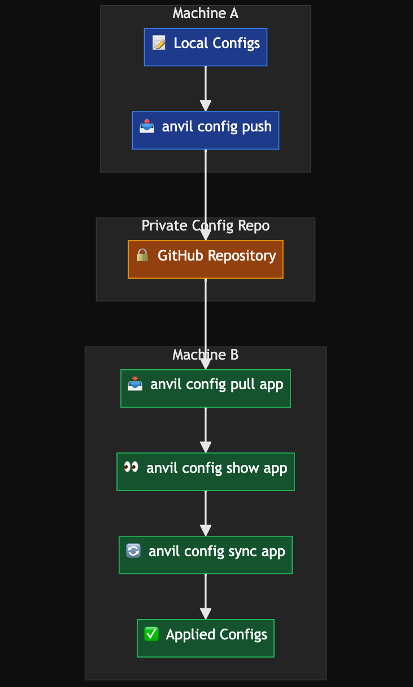

<div align="center">
  
  <h1>Anvil</h1>
</div>

<div align="center">

[](https://golang.org)
[](LICENSE)
[](#macos-focus)
[](#)
[](docs/CHANGELOG.md)

</div>

> Cast aside the burden of manual setup—let Anvil be your Samwise, carrying your configs to the very end.

**Anvil** is the complete macOS development environment automation tool. Stop manually setting up machines, hunting for configs, and dealing with inconsistent environments. With Anvil, you get zero-config tool installation, cross-machine configuration sync, and team-wide environment standardization—all in one powerful CLI.

## ✨ Why Choose Anvil

**🚀 Tool Installation** - Install your full tool-chain in one command using user defined groups and `anvil install <group-name>` or individual apps with smart deduplication. Perfect for engineers switching jobs, team onboarding or setting up new laptops.

**🔄 Configuration Sync** - No more tracking multiple configs across machines. Safely sync all dotfiles using private GitHub repositories with automatic archiving and recovery.

**🎯 Developer Experience** - Zero configuration required. Dry-run previews, beautiful output, and `anvil doctor` to automatically fix issues for you—just like popular CLI tools you already know.

## 🚀 Quick Start

### Installation

```bash
# Clone and build
git clone https://github.com/rocajuanma/anvil.git
cd anvil
go build -o anvil main.go

# Move to your PATH (optional)
sudo mv anvil /usr/local/bin/
```

### Basic Workflows

#### **🔧 Tool Installation Workflow**

```bash
# Initialize Anvil (run this first!)
anvil init

# Verify setup is working correctly with real-time progress feedback
anvil doctor

# Install applications dynamically
anvil install firefox
anvil install visual-studio-code

# Install predefined tool groups
anvil install dev        # git, zsh, iterm2, visual-studio-code
anvil install new-laptop # slack, google-chrome, 1password

# Preview before installing
anvil install docker --dry-run
```

#### **⚙️ Configuration Management Workflow**

```bash
# Set up GitHub repository (one-time setup)
# Edit ~/.anvil/settings.yaml with your repo details

# Verify connectivity with detailed progress feedback
anvil doctor connectivity

# Pull configurations from your repository
anvil config pull cursor
anvil config pull vscode

# View pulled configurations
anvil config show cursor

# Sync configuration files to their destinations
anvil config sync        # Apply pulled anvil settings
anvil config sync cursor # Apply pulled app configs

# Push local changes back to repository
anvil config push       # Push anvil settings to GitHub
```

## 📦 Installation Methods

Install individual applications or predefined groups with automatic Homebrew integration.

### Individual Applications

Install any Homebrew package by name with automatic tracking:

```bash
anvil install terraform
anvil install kubernetes-cli
anvil install postman
anvil install obsidian
```

**🎯 Smart Features:**

- Apps automatically tracked in `tools.installed_apps`
- Duplicate prevention (won't track apps already in groups)
- Manual installation detection (works with pre-installed apps)

### Predefined Groups

- **`dev`** - Essential development tools (git, zsh, iterm2, visual-studio-code)
- **`new-laptop`** - Essential applications for new machines (slack, google-chrome, 1password)

### Custom Groups

Define your own in `~/.anvil/settings.yaml`:

```yaml
groups:
  backend:
    - git
    - docker
    - postgresql
    - redis
  frontend:
    - git
    - node
    - visual-studio-code
    - figma
  devops:
    - docker
    - kubernetes-cli
    - terraform
    - vault
```

📖 **[Complete Installation Guide](docs/install.md)** - Detailed installation options, troubleshooting, and examples

## 🔧 Configuration Management

Sync dotfiles and configurations across machines using **private GitHub repositories** with full version control, automatic archiving, and safety confirmations.

### Workflow Overview



### Cross-Machine Synchronization

```bash
# MACHINE A: Push local configurations to repository
anvil config push           # Upload anvil settings with timestamped branch

# MACHINE B: Pull, review, and apply configurations
anvil config pull neovim    # Download configs to ~/.anvil/temp/neovim/
anvil config pull obsidian  # Download configs to ~/.anvil/temp/obsidian/
anvil config pull anvil     # Download anvil settings

# Review configurations before applying
anvil config show neovim    # Preview neovim configurations
anvil config show anvil     # View anvil settings

# Apply configurations with automatic archiving
anvil config sync --dry-run # Preview all changes
anvil config sync           # Apply anvil settings (archives old ones)
anvil config sync neovim    # Apply neovim configs (archives old ones)
```

### Team Configuration Sharing

```bash
# Team member shares configurations
anvil config pull team-dev-setup
anvil config show team-dev-setup

# Apply team configurations safely
anvil config sync team-dev-setup  # Archives existing configs first

# Share your own configurations
anvil config push  # Creates PR for team review
```

### Key Features

- **🔒 Private Repository Required** - Mandatory privacy protection for sensitive configuration data
- **📦 Automatic Archiving** - Every sync creates timestamped backups in `~/.anvil/archive/`
- **✅ Interactive Confirmations** - Always asks permission before overriding local configurations
- **🔍 Comprehensive Dry-Run** - Preview all changes without applying them
- **🎯 Smart Path Resolution** - Uses `configs` section in settings.yaml for app destinations
- **🌿 Timestamped Branches** - Creates branches like `config-push-18072025-1234` for safe collaboration
- **🔗 PR-Ready Workflow** - Provides direct GitHub PR links for team review
- **💡 Manual Recovery** - Easy recovery from archive directory (auto-recovery coming soon)

📖 **[Complete Configuration Guide](docs/config.md)** - Setup, authentication, repository structure, and team workflows

## ⚙️ Settings

Your development environment configuration in `~/.anvil/settings.yaml`:

```yaml
tools:
  required_tools: [git, curl, brew]
  optional_tools: [docker, kubectl]
  installed_apps: [terraform, postman, kubernetes-cli, obsidian] # Auto-tracked individual installs
groups:
  dev: [git, zsh, iterm2, visual-studio-code]
  backend: [git, docker, postgresql, redis] # Custom groups
git:
  username: "Your Name"
  email: "your.email@example.com"
github:
  config_repo: "username/dotfiles" # For config sync
  branch: "main"
  token_env_var: "GITHUB_TOKEN"
```

## 🎯 Command Reference

| Command             | Description            | Example                     |
| ------------------- | ---------------------- | --------------------------- |
| `init`              | Initialize environment | `anvil init`                |
| `install [app]`     | Install application    | `anvil install terraform`   |
| `install [group]`   | Install tool group     | `anvil install dev`         |
| `install --list`    | List available groups  | `anvil install --list`      |
| `config pull [app]` | Pull configurations    | `anvil config pull neovim`  |
| `config show [app]` | Show configurations    | `anvil config show neovim`  |
| `config sync [app]` | Apply pulled configs   | `anvil config sync cursor`  |
| `config push [app]` | Push configurations    | `anvil config push`         |
| `doctor`            | Run health checks      | `anvil doctor`              |
| `doctor [category]` | Check specific area    | `anvil doctor dependencies` |
| `doctor [check]`    | Run individual check   | `anvil doctor git-config`   |
| `doctor --fix`      | Auto-fix issues        | `anvil doctor --fix`        |

### Useful Flags

- `--dry-run` - Preview installations and changes
- `--list` - Show available groups and tracked apps
- `--concurrent` - Enable parallel installation (faster)
- `--verbose` - Show detailed output (doctor command)
- `--fix` - Automatically fix detected issues (doctor command)

## 📚 Documentation

### **Documentation & Guides**

| Guide                                          | Description                              |
| ---------------------------------------------- | ---------------------------------------- |
| **[Getting Started](docs/GETTING_STARTED.md)** | Complete setup and first workflows       |
| **[Installation Guide](docs/INSTALLATION.md)** | Platform-specific installation           |
| **[Install Command](docs/install.md)**         | Deep-dive on tool installation           |
| **[Configuration Management](docs/config.md)** | Complete config sync setup and workflows |
| **[Doctor Command](docs/doctor.md)**           | Health checks and environment validation |
| **[Examples & Tutorials](docs/EXAMPLES.md)**   | Real-world usage scenarios               |
| **[Contributing](docs/CONTRIBUTING.md)**       | Development guidelines                   |
| **[Changelog](docs/CHANGELOG.md)**             | Version history and updates              |

## 🍺 macOS Focus

Optimized specifically for macOS with:

- **Homebrew Integration** - Automatic installation and cask support
- **Native Terminal Colors** - Beautiful output in Terminal.app and iTerm2
- **GUI Application Support** - Seamless installation of Mac applications
- **Application Detection** - Smart detection of manually installed apps

## 📄 License

This project is licensed under the Apache License 2.0 - see the [LICENSE](LICENSE) file for details.

## 🙏 Acknowledgments

- [Cobra](https://github.com/spf13/cobra) - CLI framework
- [Homebrew](https://brew.sh/) - macOS package management

---

<div align="center">

**[⬆ Back to Top](#anvil)**

Made with ❤️ for macOS engineers who value consistency and automation

</div>
