# Configuration Management Workflow

This diagram shows how Anvil's configuration management commands work together to sync configurations across machines using a private GitHub repository.

```mermaid
flowchart TB
    subgraph "Machine A"
        A1["📝 Local Configs"]
        A2["📤 anvil config push"]
    end

    subgraph "Private Config Repo"
        R["🔒 GitHub Repository"]
    end

    subgraph "Machine B"
        B1["📥 anvil config pull app"]
        B2["👀 anvil config show app"]
        B3["🔄 anvil config sync app"]
        B4["✅ Applied Configs"]
    end

    A1 --> A2
    A2 --> R
    R --> B1
    B1 --> B2
    B2 --> B3
    B3 --> B4

    style A1 fill:#1e3a8a,stroke:#3b82f6,color:#ffffff
    style A2 fill:#1e3a8a,stroke:#3b82f6,color:#ffffff
    style R fill:#92400e,stroke:#f59e0b,color:#ffffff
    style B1 fill:#14532d,stroke:#22c55e,color:#ffffff
    style B2 fill:#14532d,stroke:#22c55e,color:#ffffff
    style B3 fill:#14532d,stroke:#22c55e,color:#ffffff
    style B4 fill:#14532d,stroke:#22c55e,color:#ffffff
```

## Workflow Steps

1. **Machine A**: User runs `anvil config push` to upload local configurations
2. **Private Repository**: Stores configurations securely in GitHub
3. **Machine B**: User pulls, reviews, and applies configurations:
   - `anvil config pull app` - Download configurations to temp directory
   - `anvil config show app` - Review pulled configurations
   - `anvil config sync app` - Apply configurations to local paths

## Key Features

- **🔒 Private Repository Required**: Ensures sensitive configuration data stays secure
- **📦 Automatic Archiving**: All sync operations create timestamped backups
- **✅ Interactive Confirmations**: User approval required before applying changes
- **🔍 Dry-run Support**: Preview changes without applying them
